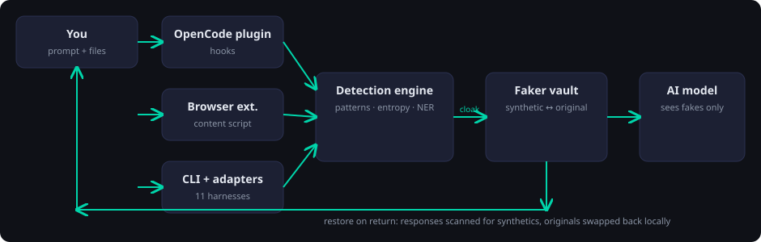

# DataCloak

> Swap real secrets for fakes before AI ever sees them — restore originals on return.  
> Local-first. Zero-config. Fully automatic.

Paste a `.env`, a DSN, or an API key into your agent — DataCloak swaps every
secret and PII value for a **realistic synthetic fake** (same shape, same
meaning, zero real data) before it reaches the model, then swaps the
originals back. The model reasons over a structurally identical prompt.

```ts
cloak('contact john.doe@acme.com, key sk-abcdefghij1234567890')
// → 'contact Nigel_Lebsack@hotmail.com, key sk-SYNTHQ4j985lvvRXTkYUwtqW8'
restore(modelReply)
// → originals back, byte-identical
```



Full walkthrough: [Architecture & how it works](architecture.md) ·
[Privacy policy](privacy.md)

## Features

- **Secrets + PII + credentials** — API keys, JWTs, PEMs, env vars, DSNs, emails, phones, IPs, names, addresses, DOB
- **Faker synthetics, not `[REDACTED]`** — the model reasons naturally
- **Every surface** — OpenCode plugin, browser extension (8 chat sites), CLI + hooks for 11 coding agents
- **Bidirectional vault** — consistent identity per session, restore on return
- **Local-only** — no account, no server, no telemetry

## Quick Start

```bash
curl -fsSL https://raw.githubusercontent.com/pratikwayal01/datacloak/master/install.sh | bash
```

Then read [Installation](installation.md) for the extension and agent hooks,
or jump to [Quick Start](quickstart.md) for the 5-minute tour.

## Contact

Bug reports and feature requests: https://github.com/pratikwayal01/datacloak/issues.
